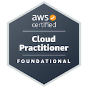
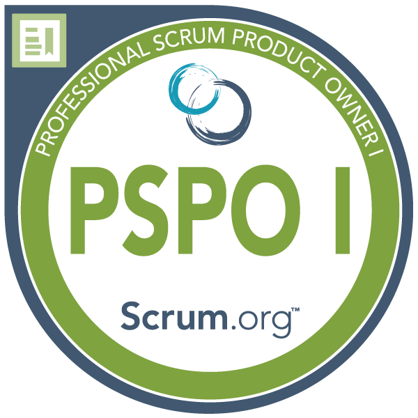
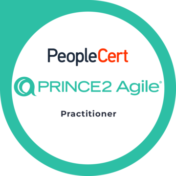

# Hi, I'm Aljoscha 👋

**Full Stack Developer** building modern web applications, REST APIs, and cloud-native solutions.

I enjoy translating complex business requirements into reliable, maintainable software. Working at the intersection of business and software development taught me to balance delivery speed, technical quality, and real operational needs.

Previously worked on internal applications supporting the Berlin International Film Festival (Berlinale) and the European Film Market (EFM), where more than 800 internal users relied on software to coordinate festival operations.

🌐 Portfolio: [dev.aljoschazoeller.com](https://dev.aljoschazoeller.com) 
💼 LinkedIn: [www.linkedin.com/in/aljoschazoeller/](https://www.linkedin.com/in/aljoschazoeller/)

---

## Featured Projects

### 🎬 Cinetiq
Designed and developed a full-stack platform for managing structured film festival data. 
**Java · Spring Boot · React · MongoDB · OAuth2 · Docker**

📎 [Live Demo](https://app.cinetiq.aljoschazoeller.com) • 🌐 [Project Details](https://dev.aljoschazoeller.com/de/projekte/cinetiq) • 💻 [Source Code](https://github.com/josch87/Cinetiq)

### ☁️ Film Festival Infrastructure

Designed and deployed scalable cloud infrastructure using Terraform and AWS. 
**AWS · Terraform · Linux · Auto Scaling · Load Balancing**

🌐 [Project Details](https://dev.aljoschazoeller.com/de/projekte/film-festival-infrastruktur) • 💻 [Source Code](https://github.com/josch87/film-festival-infrastructure)

### 🤝 Gunther

Designed and developed a progressive web app for managing personal relationships. 
**Next.js · React · JavaScript · Styled Components**

📎 [Live Demo](https://gunther.aljoschazoeller.com/) • 🌐 [Project Details](https://dev.aljoschazoeller.com/de/projekte/gunther) • 💻 [Source Code](https://github.com/josch87/Gunther)

---

## Backend Engineering
Java · Spring Boot · SQL · REST APIs · OAuth2

- Designing RESTful APIs
- Business logic implementation
- Authentication & authorization
- SQL data modeling
- Scalable backend services

## Frontend Development
TypeScript · React · Next.js · Tailwind CSS · shadcn/ui

- React & Next.js applications
- TypeScript-first development
- State management
- Responsive user interfaces
- Component architecture

## Cloud & DevOps
AWS · Terraform · Docker · CI/CD · Linux

- Infrastructure as Code
- Secure AWS networking
- Dockerized deployments
- CI/CD automation
- Linux administration

---

---

## Certifications

- AWS Certified Cloud Practitioner
- Professional Scrum Product Owner&trade; I (PSPO I)
- PRINCE2 Agile&reg; Practitioner

